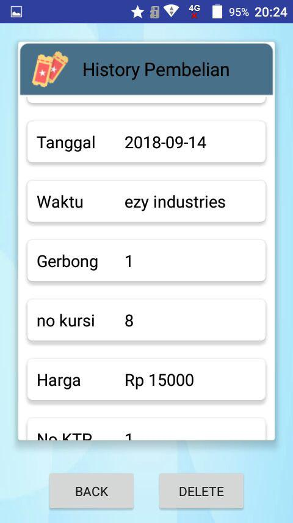

# smkcoding_rtrain
deskripsi: aplikasi untuk memudahkan kita dalam membeli tiket kereta api se-Indonesia. 

Thanks to:  
pluspng.com  
iconfinder.com  
flaticon.com  
pngtree.com  
creativemarket.com  
github.com  
stackoverflow.com  
journaldev.com  
pembina SMK CODING  
Guru SMKN 4 Malang  
